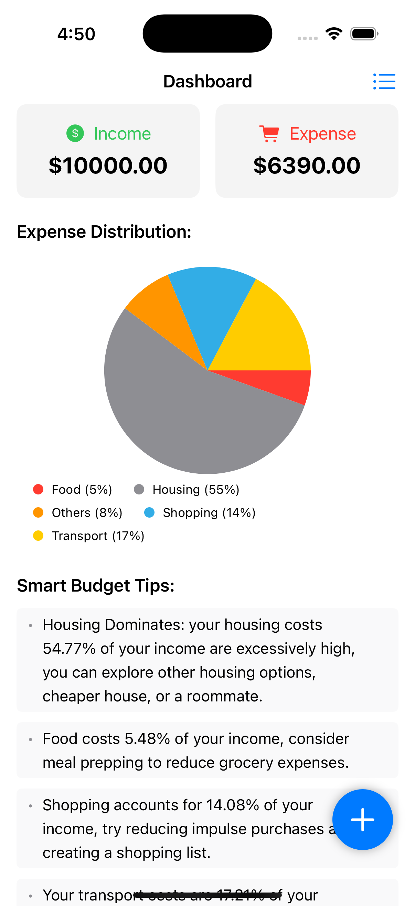
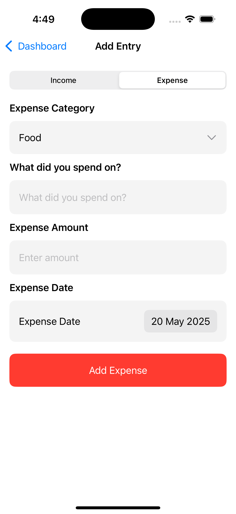
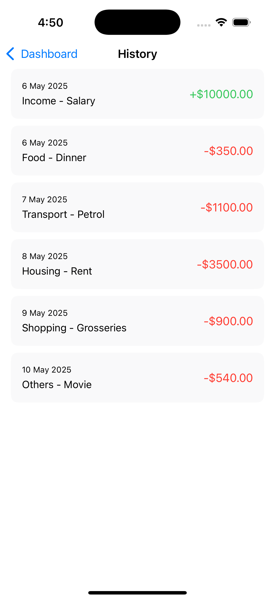

AIExpensePlanner (SwiftUI)
--------------------------

This project is a SwiftUI-based iOS application designed to help users manage their personal finances by tracking income and expenses, visualizing spending patterns, and receiving AI-powered budget tips via the Gemini API. With a clean and intuitive interface, it empowers users to make informed financial decisions.

Features
--------

1. Dashboard Overview: View total income and expenses in sleek summary cards.
2. Expense Distribution: Visualize spending by category with an interactive pie chart.
3. **Smart Budget Tips**: Get personalized budget and investment advice from the Gemini API.
4. Add Entries: Easily log income or expense entries with details like amount, category, and date.
5. Transaction History: Review all financial entries with clear details and color-coded amounts.
6. Local Persistence: Store financial data locally using UserDefaults for quick access.
7. Pull-to-Refresh: Update budget tips with a simple pull on the dashboard.


Tech Stack
----------

- SwiftUI: Modern, declarative UI framework for building the interface.
- Foundation: Handles data encoding, networking, and UserDefaults persistence.
- Gemini API: Powers AI-driven budget and investment tips.
- Combine: Manages asynchronous API calls and state updates (planned for future enhancements).


Getting Started
----------------

1. Clone the Repository:
```
git clone https://github.com/PSSPL-Mobile/AI-Expense-Planner
cd AIExpensePlanner
```

2. Open in Xcode:
- Open AIExpensePlanner.xcodeproj in Xcode 13.0 or later.
- Configure Gemini API Key:
- In Constants.swift, replace the placeholder geminiApiKey with your valid Gemini API key:static let geminiApiKey = "YOUR_API_KEY_HERE"
- Obtain a key from the Gemini API provider.

3. Build and Run:
- Select an iOS simulator or connected device in Xcode.
- Press Cmd + R to build and run the app.

Requirements & Setup Notes
--------------------------

iOS Version: iOS 15.0 or later.

Xcode: Version 13.0 or later.

Swift: Swift 5.5 or later.

Internet Connection: Required for fetching budget tips from the Gemini API.➤ Note: Financial data is stored locally, so core features (adding entries, viewing history) work offline.

Gemini API Setup:Ensure the API key is correctly configured in Constants.swift. Without a valid key, budget tips will display error messages.➤ If you encounter API errors, check the console logs for details (raw API responses are printed for debugging).

Usage
-----

- Dashboard:
  - View your total income and expenses in summary cards.
  - Explore the pie chart to see spending distribution across categories (e.g., Food, Housing).
  - Read personalized budget tips powered by the Gemini API.
  - Pull down to refresh budget tips based on your latest financial data.

- Adding Entries:
  - Tap the floating ➕ button to open the "Add Entry" screen.
  - Select "Income" or "Expense" using the segmented picker.
  - For income: Enter the amount and date.
  - For expenses: Choose a category, add a description, amount, and date.
  - Tap "Add Income" or "Add Expense" to save.

- History:
  - Tap the 📋 list icon in the navigation bar to view all transactions.
  - Entries display date, category, description, and amount (green for income, red for expenses).

Screenshots
------------
<p align="left">
  
  
  
  
</p>
